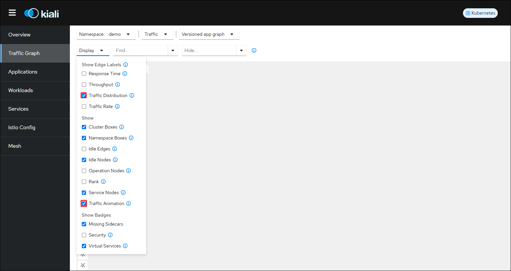

# istio monitoring Tool 

## install prometheus & kiali

1. Installing Prometheus to Collect isotio metrics

```sh
kubectl apply -f https://raw.githubusercontent.com/istio/istio/release-1.23/samples/addons/prometheus.yaml
```

2.  Installing kiali

```sh
kubectl apply -f https://raw.githubusercontent.com/istio/istio/release-1.23/samples/addons/kiali.yaml
```

If the isio version is not 1.23, write down another version and create it.  
For access, you can use `lens` or `service load balancer` type.

```sh 
apiVersion: v1
kind: Service
metadata:
  name: kiali
  namespace: istio-system
spec:
  selector:
    app: kiali
  type: LoadBalancer
  ports:
    - protocol: TCP
      port: 80
      targetPort: 20001
```

<p align="center">
  
</p>