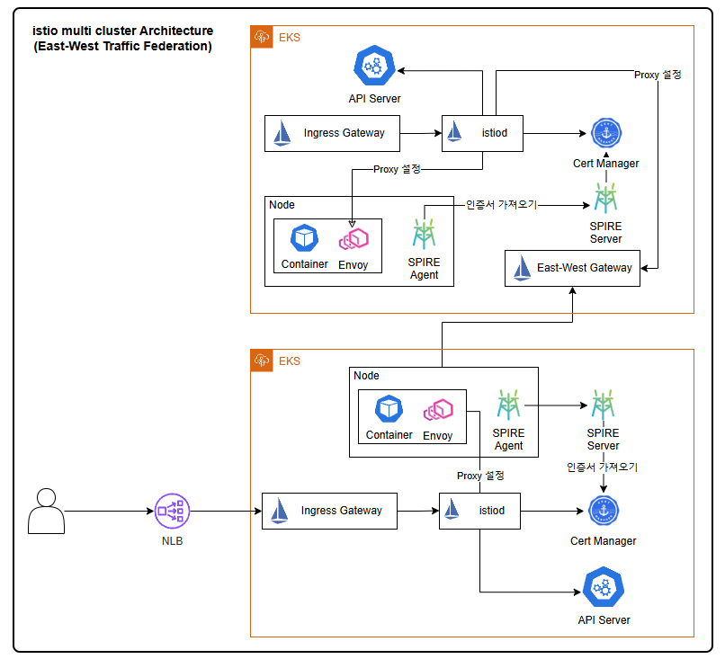
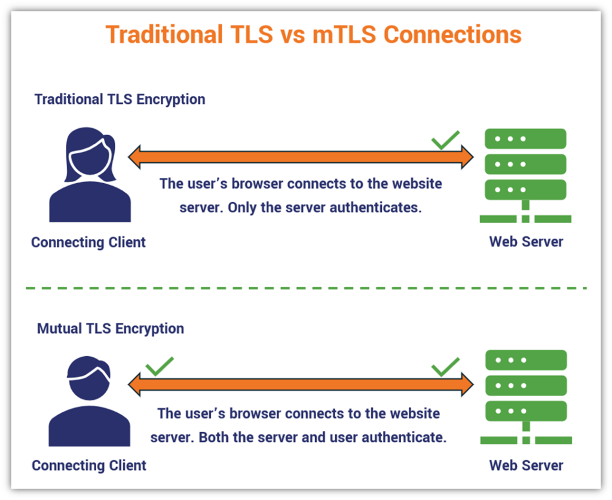

# istio multi cluster Architecture

### Goal : 
Pod , Object 들은 모두 mTLS 통신을 진행하고, A cluster에서 장애가 발생 시 B Cluster에서 대신 처리를 해야 합니다. 

## Architecture 


### Federation
Federation : 네트워크를 연결하고 리소스를 공유하는 것을 의미 합니다.   
East-West Federation : 클러스터간 직접 연결을 통해 리소스 공유하는 방식입니다.   
North-South Federation : 클러스터 외부를 경유해 리소스를 공유하는 방식입니다.   
  
### SPIFFE (Secure Production Identity Framework for everyone) : 서비스간 인증 위한 표준을 제공하는 오픈소스
SPIFFE의 구성요소 :  
    - SPIFFE ID : 서비스(워크로드)를 식별하는 고유 ID  
    - SPIFFE Verifiable identity documen(SVID): x509 인증서 또는 JWT 토큰을 발급하고, 서비스의 Identity를 제공  
    - SPIFFE Workload API : ID , SVID를 사용하기 위한 API 제공  
    - SPIRE : SPIFFE를 편하게 사용할 수 있도록 SPIFFE를 구현한 Opensource  

SPIFFE 동작 과정 :  
    - SPIFFE ID 발급  
        - 서비스는 Workload API를 통해 SVID를 요청  
        - SPIRE 서버는 정책에 따라 인증 후 발급  

### mTLS
mTLS vs TLS : TLS 인증 방식은 Web Server에 인증서만 있어도 TLS를 통신을 할 수 있습니다. 하지만, mTLS는 Client와 Web Server 모두 인증서를 가지고 있어야 TLS로 통신을 할 수 있습니다. 주로 `zero-trust architecture`에서 사용 됩니다. 아래 이미지를 참고 하세요. 



### Configuration

두 개의 Cluster를 이용하기 때문에 편하게 `apply` 등등을 이용하기 위해서 alias를 사용했습니다. alias를 사용하게 되면 --context로 통해서 cluster를 관리할 수 있습니다. 

```sh
$ aws eks update-kubeconfig --name istio-eks-cluster-1 --alias cluster-1
$ aws eks update-kubeconfig --name istio-eks-cluster-2 --alias cluster-2
```

잘 접근이 되는 지 확인. 

```sh
$ kubectl get pods -A --context cluster-1
$ kubectl get pods -A --context cluster-2
```

우선 Storageclass를 생성을 합니다. 이 경우 `annotations`에서 `storageclass.kubernetes.io/is-default-class: "true"` default-class로 설정이 되어 있기 때문에 Storageclass를 필요로 하는 helm이나 yaml 파일들이 여기 생성된 sc를 사용하게 됩니다. 

```sh
$ kubectl apply -f manifest/infra/gp3-strageclass.yaml --context cluster-1
$ kubectl apply -f manifest/infra/gp3-strageclass.yaml --context cluster-2
```

다음으로 HTTPS 통신을 위해서 cert-manager를 생성 합니다. 

```sh 
$ kubectl apply --context cluster-1 -f https://github.com/cert-manager/cert-manager/releases/download/v1.17.0/cert-manager.yaml
$ kubectl apply --context cluster-2 -f https://github.com/cert-manager/cert-manager/releases/download/v1.17.0/cert-manager.yaml
```

istio-cert들은 istio-system에 생성을 하기 위해서 istio-system 이라는 Namespace를 생성합니다.

```sh
$ kubectl create ns istio-system --context cluster-1
$ kubectl create ns istio-system --context cluster-2
```

self-signed-ca.yaml를 먼저 생성을 하고, 나서 istio-cert.yaml을 생성합니다. 이유는 CA가 구성되지 않았는데 istio-cert가 구성이 되는 건 말이 안됩니다. 

```sh
$ kubectl apply -f manifest/infra/cert/self-signed-ca.yaml --context cluster-2
$ kubectl apply -f manifest/infra/cert/self-signed-ca.yaml --context cluster-1
$ kubectl apply -f manifest/infra/cert/istio-cert.yaml --context cluster-1
$ kubectl apply -f manifest/infra/cert/istio-cert.yaml --context cluster-2
```

Amazon EKS cluster-1에 생성된 `app-node-spire`에 Private IP DNS name spire_node_wsc1에 저장을 시킵니다. 그 후에, wsc2-spire.yaml에 <spire_server_node_foo>을 sed 명령어를 이용하여 변경합니다. 변경 하는 이유는 cluster-2에게도 cluster-1에 대한 인증서를 줘야지만, mTLS를 할 수 있기 때문입니다. 

```sh
$ spire_node_wsc1=$(kubectl get nodes -l dedicated=spire-server --context cluster-1 -o jsonpath='{.items[*].metadata.name}')
$ cat ./manifest/infra/spire/wsc2-spire.yaml | sed "s|<spire_server_node_foo>|$spire_node_wsc1|g" | kubectl apply -f - --context-cluster-2
```

아래는 위에 반대 입니다. &&

```sh
$ spire_node_wsc2=$(kubectl get nodes -l dedicated=spire-server --context cluster-2 -o jsonpath='{.items[*].metadata.name}')
$ cat ./manifest/infra/spire/wsc1-spire.yaml | sed "s|<spire_server_node_bar>|$spire_node_wsc2|g" | kubectl apply -f - --context-cluster-1
```

그리고 cluster-1에 `spire-server-0`라는 이름을 가진 pods에 있는 x509 인증서 or JWT Token 내용을 cluster-2 `spire-server-0` 이름을 가진진 pods에 넣습니다. 

```sh
$ wsc1_bundle=$(kubectl exec --context cluster-1 -c spire-server -n spire --stdin spire-server-0 -- /opt/spire/bin/spire-server bundle show -format spiffe -socketPath /run/spire/sockets/server.sock)
$ kubectl exec --context cluster-2 -c spire-server -n spire --stdin spire-server-0 -- /opt/spire/bin/spire-server bundle set -format spiffe -id spiffe -id spiffe://wsc-cluster1.com --socketPath /run/spire/sockets/server.sock <<< "$wsc1_bundle"
```

위에 내용의 반대라고 생각하시면 됩니다. cluster-2에 `spire-server-0`라는 이름을 가진 pods에 있는 x509 인증서 or JWT Token 내용을 cluster-1 `spire-server-0` 이름을 가진진 pods에 넣습니다.

```sh
$ wsc2_bundle=$(kubectl exec --context cluster-2 -c spire-server -n spire --stdin spire-server-0 -- /opt/spire/bin/spire-server bundle show -format spiffe -socketPath /run/spire/sockets/server.sock)
$ kubectl exec --context cluster-1 -c spire-server -n spire --stdin spire-server-0 -- /opt/spire/bin/spire-server bundle set -format spiffe -id spiffe -id spiffe://wsc-cluster2.com --socketPath /run/spire/sockets/server.sock <<< "$wsc2_bundle"
```

이제 `istioctl` 설치 후에 istio를 배포하겠습니다. 

```sh
curl -L https://istio.io/downloadIstio | sh -
cd istio*
export PATH=$PWD/bin:$PATH
```
이제 cluster-1에 istio에 대한 설정 파일들을 apply 시켜줍니다.

```sh
istioctl install -f ./wsc1-istio-conf.yaml --context cluster-1 --skip-confirmation
kubectl  apply -f auth.yaml --context cluster-1
kubectl apply -f istio-eastwest-gw.yaml --context cluster-1
```

cluster-2에도 똑같이 apply 해줍니다.

```sh
istioctl install -f ./wsc2-istio-conf.yaml --context cluster-2 --skip-confirmation
kubectl  apply -f auth.yaml --context cluster-2
kubectl apply -f istio-eastwest-gw.yaml --context cluster-2
```

istio가 원격으로 kubernetes에 엑세스를 할 수 있도록 자격 증명이 포함된 secrets을 만들어줍니다.

```sh
wsc1_endpoint=$(aws eks describe-cluster --name istio-eks-cluster-1 --query cluster.endpoint --output text)
wsc2_endpoint=$(aws eks describe-cluster --name istio-eks-cluster-2 --query cluster.endpoint --output text)

istioctl create-remote-secret --context cluster-1 --server "$wsc1_endpoint" --name istio-eks-cluster-1 | kubectl apply -f - --context cluster-2
istioctl create-remote-secret --context cluster-2 --server "$wsc2_endpoint" --name istio-eks-cluster-2 | kubectl apply -f - --context cluster-1
```

다음으로 애플리케이션의 namespace들을 생성 해줍니다.

```sh
kubectl create ns sleep --context cluster-1
kubectl create ns helloworld --context cluster-1
kubectl create ns sleep --context cluster-2
kubectl create ns helloworld --context cluster-2
```

애플리케이션에 생성할 namespace에 `istio-injection=enable`을 활성화 해줍니다.

```sh
kubectl label --context cluster-1 namespace sleep \
    istio-injection=enabled
kubectl label --context cluster-1 namespace helloworld \
    istio-injection=enabled

kubectl label --context cluster-2 namespace sleep \
    istio-injection=enabled
kubectl label --context cluster-2 namespace helloworld \
    istio-injection=enabled
```

애플리케이션을 배포를 진행하겠습니다. 

```sh
kubectl apply -f helloworld/wsc1-helloworld.yaml -n helloworld --context cluster-1
kubectl apply -f helloworld/wsc2-helloworld.yaml -n helloworld --context cluster-2
kubectl apply -f sleep/wsc1-sleep.yaml -n sleep --context cluster-1
kubectl apply -f sleep/wsc2-sleep.yaml -n sleep --context cluster-2

kubectl apply -f helloworld/helloworld-gateway.yaml --context cluster-1
kubectl apply -f helloworld/helloworld-gateway.yaml --context cluster-2
```

모니터링 구성을 kiali를 이용해서, `mTLS`와 동작 방식을 살펴볼 수 있도록 합니다. 만약에 port-forward를 사용하게 된다면, 이 명령어를 수행한 EC2에서 Security Groups을 20001을 바운딩한 20002 포트를 열어줘야 합니다. 그리고 그 EC2에 Public IP로 접근 시에 Kiali를 확인할 수 있습니다.

```sh
kubectl apply -f https://raw.githubusercontent.com/istio/istio/release-1.24/samples/addons/prometheus.yaml --context cluster-1
kubectl apply -f https://raw.githubusercontent.com/istio/istio/release-1.24/samples/addons/kiali.yaml --context cluster-1

kubectl port-forward --address=0.0.0.0 -n istio-system service/kiali 20002:20001
```
